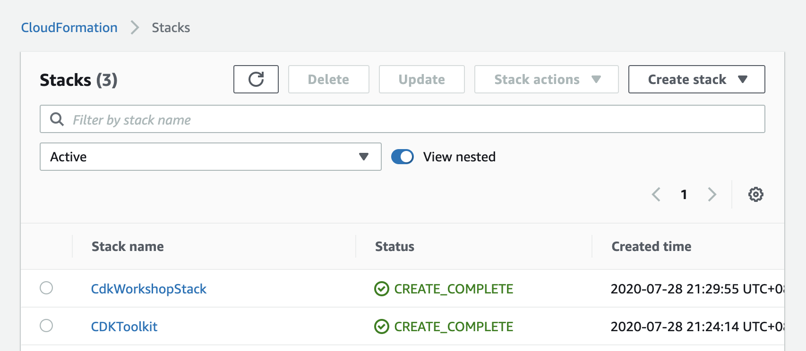
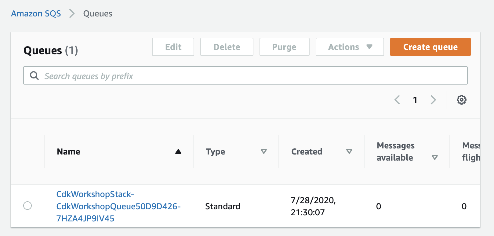

# AWS CDK Intro WorkShop of Typescript

For example, fork [CDK Workshop](https://cdkworkshop.com/) demo step-by-step.

## Environment

- [AWS Cloud9](https://aws.amazon.com/cloud9/)

## CDK commands

- [cdk init](#cdk-project-initial)
- [cdk synth](#cdk-synth)
- [cdk doctor](#cdk-doctor)
- [cdk diff](#cdk-diff)
- [cdk bootstrap](#cdk-bootstrap)
- [cdk deploy](#cdk-deploy)
- [cdk destroy](#cleanup)

## WorkShop

**If you not use `Cloud9` environment, please this step first [How to install CDK](#how-to-install-aws-cdk)**

### CDK Project initial 

1. Checking your environment and up to date version.

```
$ cdk --version
```

2. Create an empty directory on your system

```
$ mkdir cdk-intro-workshop && cd cdk-intro-workshop
```

3. We will `use cdk init` to create a new TypeScript CDK project:

```
$ cdk init sample-app --language typescript
```

### Project Structure

```bash
.
├── bin
│   └── cdk-workshop.ts
├── cdk.json
├── jest.config.js
├── lib
│   └── cdk-workshop-stack.ts
├── package.json
├── package-lock.json
├── README.md
├── test
│   └── cdk-workshop.test.ts
└── tsconfig.json
```

- `lib/cdk-workshop-stack.ts` is where your CDK application’s main stack is defined. This is the file we’ll be spending most of our time in.
- `bin/cdk-workshop.ts` is the entrypoint of the CDK application. It will load the stack defined in `lib/cdk-workshop-stack.ts`
- `package.json` is your npm module manifest. It includes information like the name of your app, version, dependencies and build scripts like “watch” and “build” (`package-lock.json` is maintained by npm)
- `cdk.json` tells the toolkit how to run your app. In our case it will be `"npx ts-node bin/cdk-workshop.ts"`
- `tsconfig.json` your project’s typescript configuration
- `.gitignore` and `.npmignore` tell git and npm which files to include/exclude from source control and when publishing this module to the package manager.
- `node_modules` is maintained by npm and includes all your project’s dependencies.

### cdk synth

AWS CDK apps are effectively only a definition of your infrastructure using code. When CDK apps are executed, they produce (or “synthesize”, in CDK parlance) an AWS CloudFormation template for each stack defined in your application.

```
$ cdk synth
```

Will output the following CloudFormation template:

```
Resources:
  CdkWorkshopQueue50D9D426:
    Type: AWS::SQS::Queue
    Properties:
      VisibilityTimeout: 300
    Metadata:
      aws:cdk:path: CdkWorkshopStack/CdkWorkshopQueue/Resource
  CdkWorkshopQueuePolicyAF2494A5:
    Type: AWS::SQS::QueuePolicy
    Properties:
      PolicyDocument:
        Statement:
          - Action: sqs:SendMessage
            Condition:
              ArnEquals:
                aws:SourceArn:
                  Ref: CdkWorkshopTopicD368A42F
```

As you can see, this template includes four resources:

- **AWS::SQS::Queue** - our queue
- **AWS::SNS::Topic** - our topic
- **AWS::SNS::Subscription** - the subscription between the queue and the topic
- **AWS::SQS::QueuePolicy** - the IAM policy which allows this topic to send messages to the queue

### cdk doctor

Inspect the current command-line environment and configurations, and collect information that can be useful for troubleshooting problems. It is usually a good idea to include the information provided by this command when submitting a bug report.

```
$ cdk doctor
```

Will output the environment informations.

```
ℹ️ CDK Version: 1.51.0 (build 8c2d53c)
ℹ️ AWS environment variables:
  - AWS_CLOUDWATCH_HOME = /opt/aws/apitools/mon
  - AWS_PATH = /opt/aws
  - AWS_AUTO_SCALING_HOME = /opt/aws/apitools/as
  - AWS_ELB_HOME = /opt/aws/apitools/elb
ℹ️ No CDK environment variables
```

### cdk diff

Before deploy, confirm the difference before and after changes.

```
$ cdk diff
```

Will output the following resources changes:

```diff
Stack CdkWorkshopStack
IAM Statement Changes
┌───┬─────────────────┬────────┬─────────────────┬─────────────────┬────────────────────┐
│   │ Resource        │ Effect │ Action          │ Principal       │ Condition          │
├───┼─────────────────┼────────┼─────────────────┼─────────────────┼────────────────────┤
│ + │ ${CdkWorkshopQu │ Allow  │ sqs:SendMessage │ Service:sns.ama │ "ArnEquals": {     │
│   │ eue.Arn}        │        │                 │ zonaws.com      │   "aws:SourceArn": │
│   │                 │        │                 │                 │  "${CdkWorkshopTop │
│   │                 │        │                 │                 │ ic}"               │
│   │                 │        │                 │                 │ }                  │
└───┴─────────────────┴────────┴─────────────────┴─────────────────┴────────────────────┘
(NOTE: There may be security-related changes not in this list. See https://github.com/aws/aws-cdk/issues/1299)

Conditions
... skip

Resources
[+] AWS::SQS::Queue CdkWorkshopQueue CdkWorkshopQueue50D9D426 
[+] AWS::SQS::QueuePolicy CdkWorkshopQueue/Policy CdkWorkshopQueuePolicyAF2494A5 
[+] AWS::SNS::Subscription CdkWorkshopQueue/CdkWorkshopStackCdkWorkshopTopicD7BE9643 CdkWorkshopQueueCdkWorkshopStackCdkWorkshopTopicD7BE96438B5AD106 
[+] AWS::SNS::Topic CdkWorkshopTopic CdkWorkshopTopicD368A42F
```

### cdk bootstrap

Bootstrapping an environment

The first time you deploy an AWS CDK app into an environment (account/region), you’ll need to install a “bootstrap stack”. This stack includes resources that are needed for the toolkit’s operation. For example, the stack includes an S3 bucket that is used to store templates and assets during the deployment process.

```
$ cdk bootstrap
```

Then:

```
   Bootstrapping environment aws://<your_account_id>/us-east-1...
CDKToolkit: creating CloudFormation changeset...
   Environment aws://<your_account_id>/us-east-1 bootstrapped.
```

### cdk deploy

Let’s deploy

```
$ cdk deploy
```

You should see a warning like the following:

```
IAM Statement Changes
┌───┬────────────────────┬────────┬────────────────────┬────────────────────┬───────────────────────┐
│   │ Resource           │ Effect │ Action             │ Principal          │ Condition             │
├───┼────────────────────┼────────┼────────────────────┼────────────────────┼───────────────────────┤
│ + │ ${CdkWorkshopQueue │ Allow  │ sqs:SendMessage    │ Service:sns.amazon │ "ArnEquals": {        │
│   │ .Arn}              │        │                    │ aws.com            │   "aws:SourceArn": "$ │
│   │                    │        │                    │                    │ {CdkWorkshopTopic}"   │
│   │                    │        │                    │                    │ }                     │
└───┴────────────────────┴────────┴────────────────────┴────────────────────┴───────────────────────┘
(NOTE: There may be security-related changes not in this list. See https://github.com/aws/aws-cdk/issues/1299)

Do you wish to deploy these changes (y/n)? y
```

This is warning you that deploying the app entails some risk. Since we need to allow the topic to send messages to the queue, enter **y** to deploy the stack and create the resources.

Output should look like the following, where ACCOUNT-ID is your account ID, REGION is the region in which you created the app, and STACK-ID is the unique identifier for your stack:

```
CdkWorkshopStack: deploying...
CdkWorkshopStack: creating CloudFormation changeset...

   CdkWorkshopStack

Stack ARN:
arn:aws ...
```

## Confirm your stack

- CloudFormation



- SQS



## Cleanup

To avoid unexpected charges to your account, make sure you clean up your CDK stack.

You can either delete the stack through the AWS CloudFormation console or use `cdk destroy`:

```
$ cdk destory 
```

## How to install AWS CDK

[AWS Cloud Development Kit (AWS CDK)](https://github.com/aws/aws-cdk)

Install or update the [AWS CDK CLI] from npm (requires [Node.js ≥ 10.13.0](https://nodejs.org/download/release/latest-v10.x/)). We recommend using a version in [Active LTS](https://nodejs.org/en/about/releases/)
⚠️ versions `13.0.0` to `13.6.0` are not supported due to compatibility issues with our dependencies.

```bash
$ npm i -g aws-cdk
```

## References

- [CDK Workshop](https://cdkworkshop.com/)
- [Examples](https://github.com/aws-samples/aws-cdk-examples)


